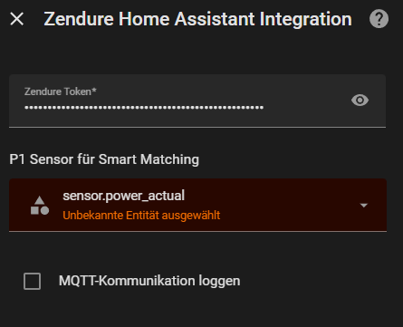
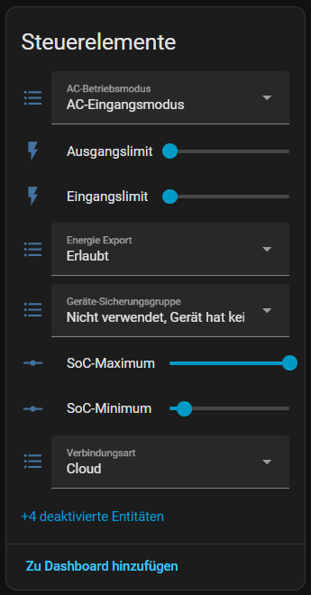
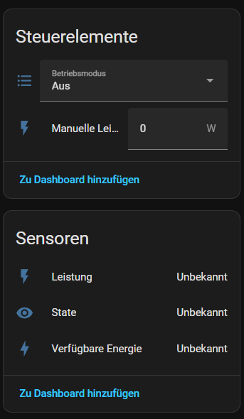

## 🧠 Preis-Vorplanung (ab Version 1.4.x)

### Was bedeutet Preis-Vorplanung?

Die KI betrachtet **nicht nur den aktuellen Strompreis**, sondern analysiert **kommende Preisspitzen** im Tagesverlauf.

Ziel:

> **Vor bekannten Preisspitzen günstig Energie speichern –
aber nur dann, wenn es wirklich sinnvoll ist.**

### Wie funktioniert das?

1. Analyse der kommenden Preisstruktur
2. Erkennung einer relevanten Preisspitze:
   - **sehr teuer** oder
   - **teuer + konfigurierbare Gewinnmarge**
3. Bewertung der günstigen Zeitfenster **vor** der Spitze
4. Laden aus dem Netz **nur wenn**:
   - aktuell ein günstiges Zeitfenster aktiv ist
   - kein relevanter PV-Überschuss vorhanden ist
   - der Akku nicht voll ist

➡️ **Keine Zeitpläne, kein Dauerladen, kein Zwang**

---

## ⚡ Sehr teure Strompreise (Prioritätslogik)

Bei **sehr teuren Strompreisen** gilt:

- Entladung hat **absolute Priorität**
- unabhängig vom Betriebsmodus
- unabhängig von PV-Ertrag
- begrenzt nur durch:
  - SoC-Minimum
  - Hardware-Grenzen (max. 2400 W)

➡️ Ziel: **Netzbezug bei extremen Preisen maximal vermeiden**

---

## Sicherheitsmechanismen

### SoC-Minimum
- Unterhalb dieses Wertes wird **nicht entladen**

### SoC-Maximum
- Oberhalb dieses Wertes wird **nicht weiter geladen**

---

## 🧯 Notladefunktion (verriegelt)

- Aktivierung bei kritischem SoC
- Laden bis mindestens SoC-Minimum
- Automatische Deaktivierung
- Kein Dauer-Notbetrieb

---

## ⚠️ WICHTIG: Zwingende Voraussetzungen

Damit die Integration **stabil und korrekt** arbeitet, **müssen** folgende Punkte eingehalten werden.

### 1️⃣ Zendure Original-App

- **Lade- und Entladeleistung auf max. 2400 W setzen**
- **HEMS deaktivieren**
- ggf. vorhandene Stromsensoren **entfernen**

➡️ Die Steuerung erfolgt **ausschließlich** durch Home Assistant.

### 2️⃣ Zendure Home-Assistant Integration

- **Keinen P1-Sensor auswählen**

  

  - ggf. vorausgewählten Sensor **entfernen**

- **Energie-Export: „Erlaubt“**

  

- **Zendure Manager → Betriebsmodus: AUS**

  

⚠️ Falsche Einstellungen hier führen zu:
- Entladeabbrüchen
- falschen Ladezuständen
- blockierten AC-Modi

### 3️⃣ Strompreis-Integration (optional, empfohlen)

Unterstützt werden u. a.:

- **Tibber – Preisinformationen & Bewertungen**
- **EPEX Spot Preis-Integrationen**

➡️ Beide liefern kompatible Datenformate
➡️ Keine zusätzliche Anpassung nötig
