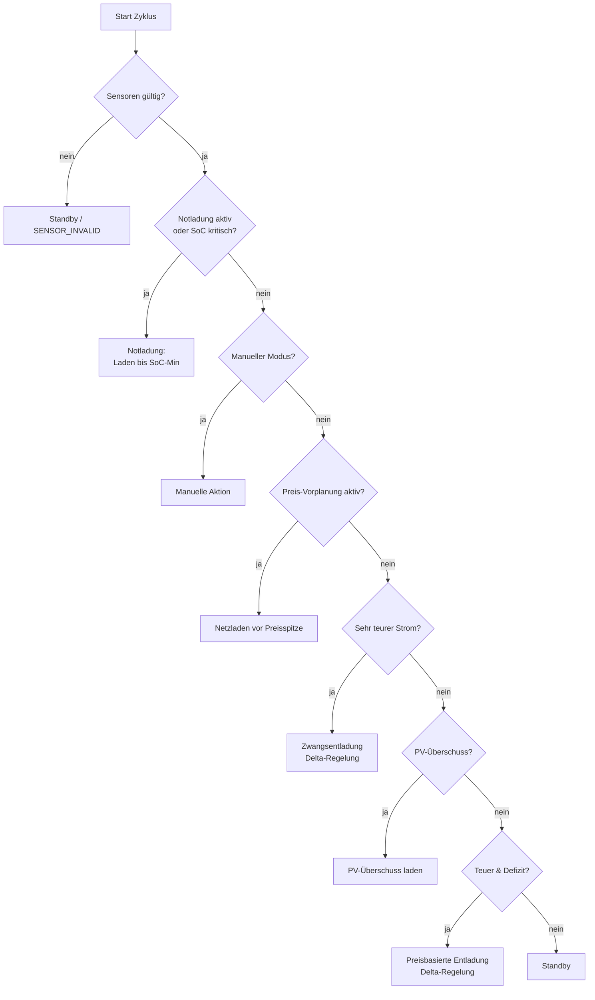
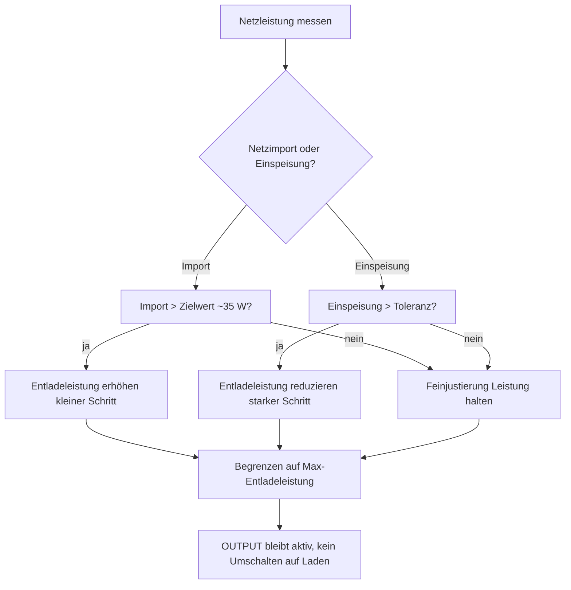
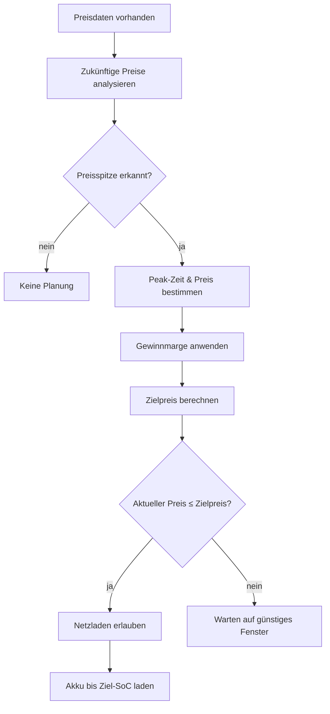
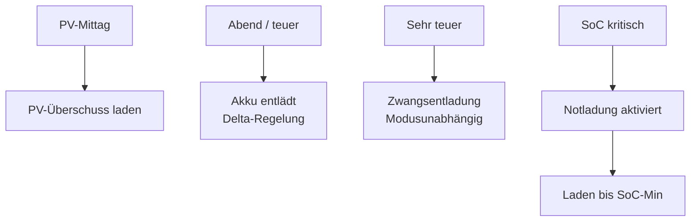

# Zendure SmartFlow AI – Anleitung  
Version: 1.4.x  
Stand: 27.01.2026  

> Diese Anleitung erklärt **nicht nur was** die Integration tut, sondern vor allem **wie und warum** die KI entscheidet.  
> Ziel: Du sollst jederzeit nachvollziehen können, **warum** gerade geladen, entladen oder Standby ist –  
> und wie du dieses Verhalten gezielt beeinflussen kannst.

---

## Inhaltsverzeichnis

1. Überblick: Was macht die KI wirklich?
2. Datenquellen: Welche Sensoren werden gelesen?
3. Zentrale Begriffe & Zustände
4. Entscheidungs-Engine: Prioritäten & Ablauf
5. Delta-Regelung (neues Herzstück)
6. Notladung (Safety & Verriegelung)
7. Betriebsmodi im Detail
8. Manuelle Aktion
9. Preislogik & Preis-Vorplanung
10. PV-Überschuss-Laden
11. Entladen zur Defizitdeckung
12. Leistungs-Limits & Hardwaregrenzen
13. Sehr teure Strompreise (Very Expensive)
14. Zendure-Ansteuerung (AC-Modus)
15. Transparenz & Debugging
16. Entscheidungsgrund (`decision_reason`)
17. Typische Szenarien
18. Häufige Stolperfallen
19. Zusammenfassung

---

## 1) Überblick: Was macht die KI wirklich?

Die Integration läuft zyklisch (Update-Intervall) und trifft **in jedem Zyklus eine vollständige Entscheidung**:

- AC-Modus (Input / Output)
- Ladeleistung (Input-Limit)
- Entladeleistung (Output-Limit)

Die Entscheidung basiert auf:

- Batterie-SoC
- PV-Leistung
- realer Hauslast
- Netzbezug / Einspeisung
- Strompreis (jetzt & Zukunft)
- Benutzer-Einstellungen
- interner Persistenz (z. B. Preis-Latch, Notladung)

Die KI ist **deterministisch**:

> Gleiche Situation → gleiche Entscheidung.

---

## 2) Datenquellen

### Pflicht
- Batterie-SoC (%)
- PV-Leistung (W)

### Optional
- Strompreis „Jetzt“
- Strompreis-Zeitreihe (z. B. Tibber oder EPEX)
- Grid-Daten:
  - SINGLE (ein Sensor)
  - SPLIT (Import + Export getrennt)

### Zendure-Steuerung
- AC-Mode (Select)
- Input-Limit (Number)
- Output-Limit (Number)

---

## 3) Zentrale Begriffe & Zustände

### Hauslast (entscheidend!)
Hauslast ist der **tatsächliche Gesamtverbrauch des Hauses**.

Sie wird **nicht** direkt gemessen, sondern korrekt hergeleitet:

- Netzbezug
- plus Eigenverbrauch (PV + Akku)
- minus Einspeisung

Damit kennt die KI immer die **echte Last**, unabhängig davon,  
ob sie gerade aus PV, Akku oder Netz gedeckt wird.

---

## 4) Entscheidungs-Engine: Prioritäten & Ablauf

Die KI arbeitet **streng prioritätsbasiert**.  
Eine niedrigere Regel kann **niemals** eine höhere überschreiben.

Prioritäten (von oben nach unten):

1. Notladung (Safety, verriegelt)
2. Manueller Modus
3. Preis-Vorplanung (Netzladen)
4. Sehr teure Preise (Zwangsentladung)
5. PV-Überschuss-Laden
6. Preisbasierte Entladung
7. Standby

### Diagramm – Entscheidungsfluss

---

## 5) Delta-Regelung (zentrales neues Konzept)

Die **Delta-Regelung** ist das Herzstück der neuen Version.

### Ziel
> Netzbezug **nahe 0 W halten**,  
> ohne Umschalten zwischen Laden ↔ Entladen.

### Grundidee
Die KI arbeitet **inkrementell**:

- Sie merkt sich die letzte Entladeleistung
- betrachtet den aktuellen Netzbezug (+) oder die Einspeisung (−)
- passt die Entladeleistung **schrittweise** an

Kein Springen.  
Kein Umschalten auf „Laden“.  
Kein Pendeln.

---

### Zielwert
Die Regelung lässt bewusst einen kleinen Netzbezug stehen:

- Ziel-Netzbezug: ca. **30–40 W**

Warum?
- Messrauschen
- Phasenverschiebung
- Trägheit der Hardware

So bleibt der AC-Modus **stabil auf OUTPUT**.

---

### Verhalten bei Netzimport
- Import steigt → Entladeleistung wird erhöht
- aber **gedeckelt** und **schrittweise**

### Verhalten bei Einspeisung
- Einspeisung erkannt → Entladeleistung wird reduziert
- **niemals sofort auf 0**
- kein automatisches Umschalten auf Laden

### Diagramm – Delta-Regelung

---

## 6) Notladung (Safety)

### Trigger
- SoC ≤ „Notladung ab SoC“

### Verhalten
- Notladung wird **verriegelt**
- Entladen = 0 W
- Laden bis mindestens **SoC-Minimum**

### Ende
- Erst wenn SoC ≥ SoC-Minimum
- kein manuelles Beenden nötig

---

## 7) Betriebsmodi im Detail

### Automatik (empfohlen)
- PV-Überschuss laden
- Preis-Vorplanung aktiv
- Entladen bei teurem Strom
- Delta-Regelung aktiv
- Sehr teuer hat absolute Priorität

### Sommer
- Fokus Autarkie
- Entladen bei Defizit
- Preislogik deaktiviert
- Delta-Regelung aktiv

### Winter
- Fokus Kostenersparnis
- Frühere Entladung bei teuerem Strom
- Preis-Vorplanung aktiv

### Manuell
- KI vollständig deaktiviert
- Nur die manuelle Aktion zählt

---

## 8) Manuelle Aktion

### Standby
- Laden 0 W
- Entladen 0 W

### Laden
- Laden mit Max-Leistung
- Preise & PV werden ignoriert

### Entladen
- Delta-Regelung deckt Defizit
- Kein Umschalten auf Laden

---

## 9) Preislogik & Preis-Vorplanung

Die Preis-Vorplanung analysiert:
- kommende Preisspitzen
- günstige Zeitfenster davor

Ziel:
> Akku **gezielt** vor teuren Phasen laden.

### Diagramm – Preis-Vorplanung

---

## 10) PV-Überschuss-Laden

Voraussetzungen:
- realer PV-Überschuss
- SoC < SoC-Maximum
- keine aktive Entladung

Ladeleistung:
- Minimum aus
  - PV-Überschuss
  - Max-Ladeleistung

---

## 11) Entladen zur Defizitdeckung

- Defizit = Hauslast > PV
- Entladung wird **dynamisch geregelt**
- Ziel: Netzbezug ≈ 30–40 W

---

## 12) Leistungs-Limits

### Max. Ladeleistung
- PV-Laden
- Netzladen
- Notladung

### Max. Entladeleistung
- Normalbetrieb
- Preisentladung
- Manuell

---

## 13) Sehr teure Strompreise (Very Expensive)

Wenn:
- Preis ≥ Sehr-teuer-Schwelle

Dann:
- Entladung immer aktiv
- Modus egal
- Delta-Regelung bleibt aktiv
- Limit wird **temporär ignoriert**
- Hardwaregrenze (~2400 W) gilt

---

## 14) Zendure-Ansteuerung

Pro Zyklus:
- AC-Mode
- Input-Limit
- Output-Limit

Grundregel:
- INPUT → Output = 0
- OUTPUT → Input = 0

---

## 15) Transparenz & Debugging

Sensoren:
- KI-Status
- Empfehlung
- Entscheidungsgrund
- Hauslast
- Ø Ladepreis
- Gewinn

Alle internen Werte stehen im `details`-Attribut.

---

## 16) Entscheidungsgrund (`decision_reason`)

Der Sensor zeigt **exakt**, welche Regel aktiv ist.

Beispiele:
- `price_based_discharge`
- `very_expensive_force_discharge`
- `delta_discharge_adjust`
- `planning_charge_before_peak`
- `standby_no_condition_met`

---

## 17) Typische Szenarien

### Diagramm – Alltagsszenarien

---

## 18) Häufige Stolperfallen

- Energie-Export nicht erlaubt
- Zendure Manager nicht auf AUS
- P1-Sensor gesetzt
- Erwartung: permanentes Entladen

---

## 19) Zusammenfassung

Die neue KI ist:

- stabil
- inkrementell
- nicht pendelnd
- preis- und lastbewusst
- vollständig erklärbar

**Kein Raten. Keine Magie. Nur saubere Regelung.**
